# AutoLogMiner 架构文档（Architecture）

> 文档版本：1.0 · 更新日期：2026-09-10 · 描述对象：`app/`（T1–T19 已完成）
> 本文档说明系统分层、组件职责、请求/SSH/LLM 主链路与关键设计决策。

## 1. 系统上下文

AutoLogMiner 是一个本地优先的单体 Web 应用：单个 FastAPI 进程同时提供
页面渲染、REST API 与 SSE 流式接口，数据落在本地 SQLite 文件里。
它对外依赖两类外部系统：

- **被管理的 Linux 服务器**：通过 SSH（asyncssh）采集指标、拉取日志、执行命令。
- **LLM 供应商**：通过 OpenAI 兼容协议（openai AsyncOpenAI）做日志诊断与健康分析。

浏览器通过同源 HTTP 访问应用；除 `GET /api/health` 与静态资源外，
所有 `/api/*` 请求都要携带管理员 Bearer 令牌。

## 2. 分层架构

```
┌─────────────────────────────────────────────────────────────┐
│  表现层  app/templates/*.html (Jinja2) + app/static/js/*.js  │
│  9 个页面 · vanilla JS · Chart.js/GSAP (CDN) · API 令牌注入   │
└──────────────────────────────┬──────────────────────────────┘
                               │ HTTP / SSE
┌──────────────────────────────▼──────────────────────────────┐
│  接口层  app/main.py (鉴权中间件 + 页面路由 + 健康检查)        │
│          app/routes/*.py (8 个 APIRouter，前缀 /api)          │
└──────────────────────────────┬──────────────────────────────┘
                               │ 调用
┌──────────────────────────────▼──────────────────────────────┐
│  服务层  ssh · monitor · llm · prompt · log_filter           │
│          scheduler · alerting                                │
└──────────────────────────────┬──────────────────────────────┘
                               │
┌──────────────────────────────▼──────────────────────────────┐
│  数据层  app/db.py (aiosqlite, WAL, foreign_keys=ON)          │
│          6 张表 · app/models/schemas.py (Pydantic)           │
└──────────────────────────────────────────────────────────────┘
```

## 3. 组件职责

### 3.1 入口与中间件（`app/main.py`）

- 创建 `FastAPI` 应用，关闭自动文档（`docs_url=None` 等）。
- lifespan 启动顺序：`migrate_legacy_db()` → `config.ensure_fernet_key()`
  → `await init_db()` → `start_scheduler()`；关闭时 `shutdown_scheduler()`。
- `admin_token_auth` HTTP 中间件对 `/api/*` 做 Bearer 校验。
- 挂载 `/static`，注册 9 条页面路由与 8 个 API 路由模块。
- `GET /api/health` 定义在 `main.py` 内，是唯一免鉴权的 API。

### 3.2 API 路由（`app/routes/`）

| 模块 | 前缀 | 职责 |
|------|------|------|
| `dashboard.py` | `/api` | 仪表盘聚合 + 多机对比 |
| `servers.py` | `/api` | 服务器 CRUD、健康、趋势、日志、执行、内联诊断、告警、导出 |
| `diagnose.py` | `/api` | 非流式诊断 + SSE 流式诊断 + 凭证解析 |
| `history.py` | `/api` | 诊断历史列表 / 详情 / Markdown 导出 |
| `providers.py` | `/api/providers` | 供应商 CRUD + 设为默认 |
| `timeline.py` | `/api` | 四类事件聚合时间线 |
| `knowledge.py` | `/api` | 知识库列举 / 上传 / 删除 |
| `demo.py` | `/api` | 演示数据生成 / 重置 |

### 3.3 服务层（`app/services/`）

- `ssh.py`：连接重试、命令执行、日志拉取、Fernet 加解密。
- `monitor.py`：健康采集脚本、输出解析、健康分析与日志分析调用。
- `llm.py`：AsyncOpenAI 客户端 LRU 缓存、诊断（流式/非流式）、JSON 提取。
- `prompt.py`：系统提示词、知识库注入、日志围栏包裹（唯一一对围栏）。
- `log_filter.py`：信号行提取、上下文保留、去重、截断、安全尾行。
- `scheduler.py`：APScheduler 每分钟扫描 + 每 24h 数据清理。
- `alerting.py`：阈值比对、冷却期、钉钉/飞书双格式 Webhook。

### 3.4 数据层

- `app/db.py`：连接工厂、建表、旧库迁移、孤儿清理、各表 CRUD、时间线聚合、数据清理。
- `app/models/schemas.py`：`DiagnosisResult`、`DiagnoseRequest`、供应商请求/响应模型
  （响应模型在 `model_validator` 中对 `api_key` 脱敏）。

## 4. 请求 / SSH / LLM 主链路

下图覆盖三条典型链路：**健康检查**（SSH 采集 → LLM 摘要 → 入库 → 告警）、
**日志诊断**（远程拉取 → 过滤 → LLM 流式 → SSE 回传）、
**受控执行**（命令分类 → SSH 执行 → 审计）。

```mermaid
flowchart TD
    Browser["浏览器 (vanilla JS)"] -->|"Bearer token"| MW{"admin_token_auth<br/>/api/* 鉴权中间件"}
    MW -->|"401"| Browser
    MW -->|"放行"| Router["FastAPI 路由层"]

    subgraph Health["健康检查链路"]
        Router -->|"POST /api/servers/{id}/health"| Collect["monitor.collect_metrics"]
        Collect -->|"SSH 一体脚本"| SSH["ssh.exec_command<br/>(3 次重试 1s/2s/4s)"]
        SSH -->|"7 类指标原始文本"| Parse["monitor.parse_health_output"]
        Parse -->|"结构化 metrics"| Analyze{"analyze_health<br/>指标正常?"}
        Analyze -->|"是"| Skip["跳过 LLM<br/>返回『无需处理』"]
        Analyze -->|"否"| LLM["llm.get_client →<br/>AsyncOpenAI 健康摘要"]
        Skip --> SaveHC["db.save_health_check"]
        LLM --> SaveHC
        SaveHC --> Alert["alerting.check_and_alert<br/>阈值 + 冷却 + Webhook"]
    end

    subgraph Diagnose["日志诊断链路"]
        Router -->|"POST /api/servers/{id}/logs"| Guard{"参数白名单<br/>log_path / unit / lines"}
        Guard -->|"非法"| R400["HTTP 400"]
        Guard -->|"合法"| Tail["ssh.tail_log / fetch_journalctl"]
        Tail -->|"原始日志"| Filter["log_filter.smart_filter_log<br/>信号 + 上下文 + 去重 + 尾行"]
        Filter --> Prompt["prompt.build_messages<br/>系统提示 + 知识库 + 围栏"]
        Prompt --> Stream["llm.diagnose_stream<br/>SSE 增量"]
        Stream -->|"data: chunk"| Browser
        Stream -->|"data: [DONE]"| Browser
        Stream --> SaveDx["db.save_diagnosis"]
    end

    subgraph Exec["受控执行链路"]
        Router -->|"POST /api/servers/{id}/execute"| Classify{"_classify_command<br/>元字符 / 白名单 / 确认档"}
        Classify -->|"reject"| R400
        Classify -->|"confirm 且未确认"| R400
        Classify -->|"execute / 已确认"| ExecSSH["ssh.exec_command"]
        ExecSSH --> Audit["db.save_execution<br/>审计日志"]
    end

    Router -->|"GET /api/health 豁免"| Health2["返回 {'status':'ok'}"]
```



## 5. 数据模型

数据库文件：`data/autologminer.db`（SQLite，WAL 模式，`foreign_keys=ON`）。

| 表 | 关键字段 | 关系 |
|----|----------|------|
| `servers` | name, host, port, username, auth_type, ssh_password, ssh_key_path, schedule_interval, alert_cpu/mem/disk, webhook_url, env, status, last_checked_at, **is_demo** | 父表 |
| `health_checks` | server_id, timestamp, cpu/mem/disk_percent, load_avg, service_status, ai_summary, raw_output | FK → servers `ON DELETE CASCADE` |
| `alerts` | server_id, check_id, alert_type, severity, message, is_resolved, created_at, resolved_at | FK → servers CASCADE；FK → health_checks SET NULL |
| `execution_logs` | server_id, command, stdout, stderr, exit_code, executed_at | FK → servers CASCADE |
| `diagnoses` | timestamp, log_preview, severity, summary, full_result | 独立 |
| `providers` | name, api_key, base_url, model, is_default, created_at | 独立 |

## 6. 鉴权设计

- 令牌来源：环境变量 `ADMIN_TOKEN`（`.env`），建议 `openssl rand -hex 16` 生成。
- 校验逻辑：取 `Authorization` 头，按空格切分为 scheme 与 provided；
  要求 `scheme.lower() == "bearer"` 且 `secrets.compare_digest` 通过。
- 豁免：`GET /api/health`、`/static/*`、9 条页面路由（不匹配 `/api/` 前缀，天然豁免）。
- 空令牌：不拒绝启动，`run.py` 打印 WARN 并强制 `host=127.0.0.1`。
- 前端：`static/js/api.js` 定义 `window.apiFetch`，从
  `localStorage("autologminer_token")` 读取令牌并注入请求头；遇 401 弹令牌输入框，
  保存后重试一次。

## 7. 命令执行安全策略

`app/routes/servers.py::_classify_command` 是确定性分类器，返回三档：

1. **reject（400）**：非字符串或空；含任一 shell 元字符
   `` ; & | ` $ ( ) < > { } `` 或换行；`shlex.split` 失败；参数 token 不匹配
   `[A-Za-z0-9._/=:@,+-]+`。
2. **execute（直接档）**：首 token 命中白名单
   （`df ls cat tail head free uptime ps journalctl du netstat ss top date
   whoami id hostname uname`），或白名单目录 `/bin /usr/bin /sbin /usr/sbin`
   下的绝对路径，或 `systemctl status`。
3. **confirm（确认档）**：其余命令，必须 `confirm=true` 才执行。

关键设计：**先拒绝元字符再分类**，杜绝 `ls; rm -rf ~` 这类前缀绕过；
不使用 `shlex.quote` 包装日志路径，避免 `*` 被引号化导致 glob 静默失效。

## 8. SSH 层设计

- 每次命令新建连接、用完即关（`finally: conn.close()`），不使用连接池。
- `_connect` 重试 3 次，退避 `2 ** attempt`（1s/2s/4s）。
- 密码用 Fernet 加解密；密钥由 `config.ensure_fernet_key()` 在 lifespan 内显式生成，
  用 `fcntl.flock` 串行化保证多进程安全、只写一行。
- `ssh.py` 通过 `from app import config` 动态读取 `config.SSH_ENCRYPTION_KEY`，
  避免 import 时的值绑定导致使用空密钥。

## 9. LLM 层设计与回退

- `_get_client(api_key, base_url)` 使用 `lru_cache(maxsize=16)` 复用客户端。
- 凭证解析顺序（`diagnose.py::_resolve_credentials`）：
  指定 `provider_id` → 查该供应商；否则查默认供应商；若供应商缺失或 `api_key` 为空，
  回退到 `.env` 的 `LLM_API_KEY` / `LLM_BASE_URL` / `LLM_MODEL`。
- `db.get_default_provider()` 过滤 `api_key != ''`，防止空 key 供应商顶掉 `.env` 回退。
- 提示词围栏唯一：`log_filter` 只输出纯文本，`prompt.build_messages` 负责包裹唯一一对
  Markdown 围栏，消除嵌套。

## 10. 调度设计

- `AsyncIOScheduler` 注册两个任务：
  健康检查（每 1 分钟，`max_instances=1`，`misfire_grace_time=30`）与
  数据清理（每 24 小时）。
- 健康检查任务用 `asyncio.gather` 并发处理所有启用调度的服务器。
- 连接失败时把服务器标记为 `offline`。

## 11. 告警设计

- 阈值列表 `[("cpu", …), ("mem", …), ("disk", …)]`，逐项比对。
- 冷却期通过 `db.get_recent_alert(server_id, type, minutes)` 查询未恢复告警实现。
- Webhook 发送在 `asyncio.to_thread` 中执行，不阻塞事件循环。

## 12. 前端架构

- 9 个 Jinja2 模板，共享 `static/js/api.js` 的 `apiFetch`。
- 模块化脚本：`dashboard.js` / `servers.js` / `diagnose.js` / `alerts.js` /
  `timeline.js` / `knowledge.js` / `demo.js`，统一在 `app.js` 之前加载。
- 唯一 autoload 段落按权威 9 条路由分发，避免重复请求。
- 移除内联 `onclick`，改用 `data-*` + `addEventListener`；LLM 派生值统一转义，
  消除存储型 XSS。

## 13. 运行时与部署

| 项 | 值 |
|----|----|
| 启动命令 | `python run.py` |
| 绑定地址 | `127.0.0.1`（`HOST` 可覆盖；空令牌时强制回环） |
| 端口 | 8080 |
| 数据库 | `data/autologminer.db` |
| 依赖 | `requirements.txt`（运行时）、`requirements-dev.txt`（开发/测试） |
| 质量门 | `ruff check .` + `pytest -q`（见 `.github/workflows/ci.yml`） |

## 14. 关键设计决策

1. **单体 + 本地优先**：单进程同时服务页面与 API，降低部署与调试成本。
2. **SQLite WAL**：以最小复杂度获得并发读写能力，无需引入外部数据库。
3. **中间件式鉴权**：单点拦截全部 `/api/*`，避免逐个端点漏加保护。
4. **确定性命令策略**：把「AI 建议」与「实际执行」之间的安全边界做成可测试的纯函数。
5. **SSH 即用即关**：牺牲连接复用换取隔离与简单性，符合低频运维操作场景。
6. **降级优先**：SSH 与 LLM 失败都不阻断数据落库与页面可用性。
7. **零构建前端**：不引入打包工具，降低学生用户的上手门槛。
