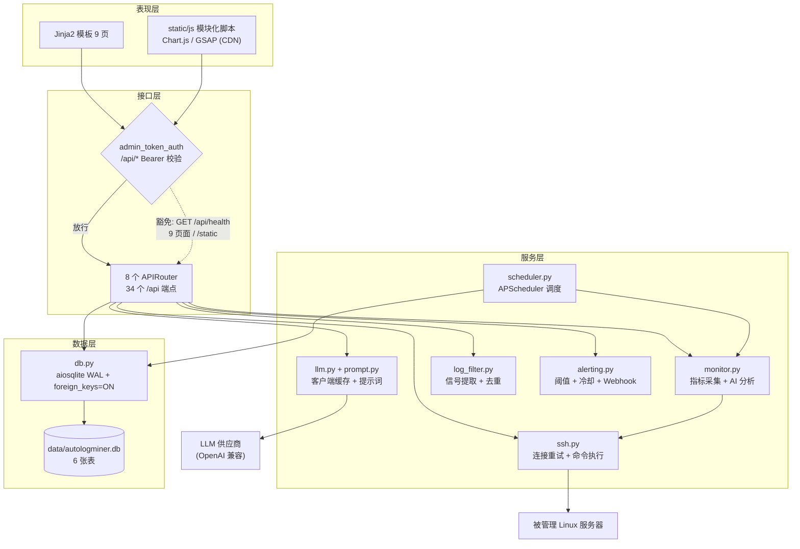
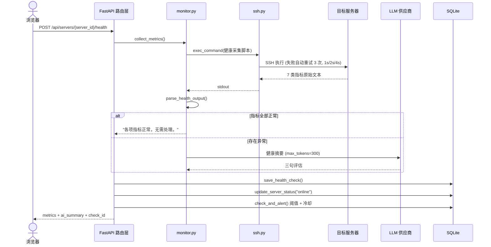
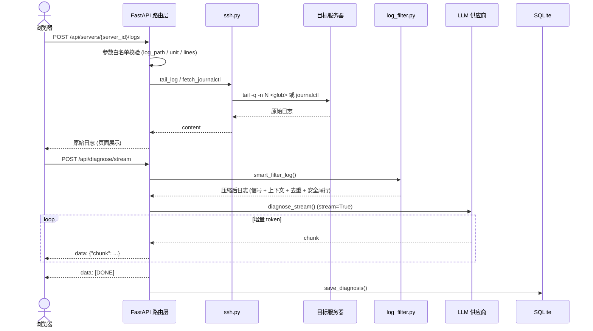
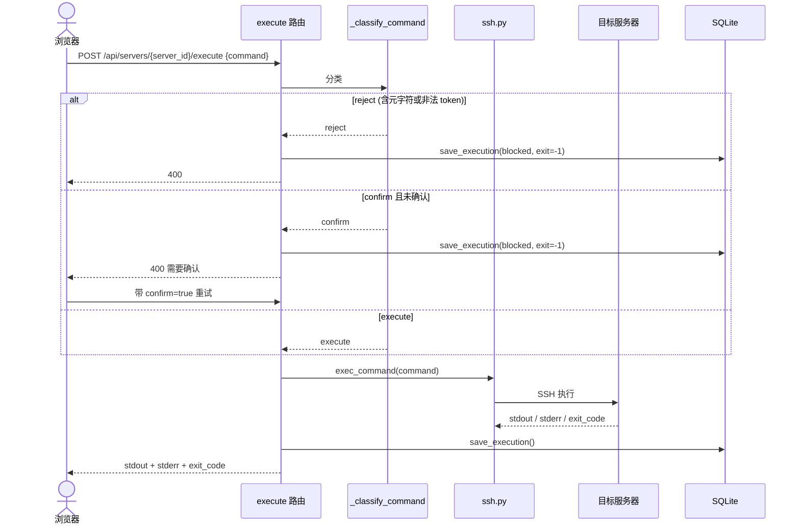

# AutoLogMiner：AI 驱动的运维工作台

[](https://github.com/usernameeve/AutoLogMiner/actions/workflows/ci.yml)


> 把服务器巡检、健康检查、阈值告警、AI 日志诊断、受控远程修复与事件归档，收敛进一个本地优先、默认安全、可离线演示的 Web 工作台。

AutoLogMiner 是一个单进程的 FastAPI 应用：一个页面看全所有服务器状态，一次点击完成 SSH 指标采集与 AI 健康评估，一段日志经流式诊断变成「摘要 + 分级 + 根因 + 可执行修复步骤」，一条修复命令经确定性安全策略判定后才能落地执行，全过程自动留痕。数据落在本地 SQLite，默认只监听 `127.0.0.1:8080`。

---

## 目录

- [项目简介](#项目简介)
- [功能特性](#功能特性)
- [快速开始](#快速开始)
- [使用介绍](#使用介绍)
- [技术架构与实现](#技术架构与实现)
- [安全模型](#安全模型)
- [数据模型](#数据模型)
- [API 端点](#api-端点)
- [目录结构](#目录结构)
- [开发与测试](#开发与测试)
- [配置项](#配置项)
- [常见问题与故障排查](#常见问题与故障排查)
- [风险与后续工作](#风险与后续工作)
- [文档索引](#文档索引)

---

## 项目简介

### 定位

AutoLogMiner 面向**单管理员、内网可信环境、本地优先**的运维排障场景。它不追求替代 ELK / Prometheus 这类平台，而是解决一个具体问题：把「发现问题 → 定位原因 → 受控修复 → 留下记录」这条链路压缩到同一个界面里，中间不切换工具。

| 维度 | 说明 |
|------|------|
| 部署形态 | 单进程 Web 应用，页面、REST API、SSE 流式接口同源提供 |
| 数据存储 | 本地 SQLite 文件 `data/autologminer.db`，无需外部数据库 |
| 访问控制 | 单管理员 Bearer 令牌，默认仅监听 `127.0.0.1` |
| 目标用户 | 运维工程师、后端开发者，以及想理解排障流程的学生 / 自学者 |
| 依赖外部 | 被管理的 Linux 服务器（SSH）、LLM 供应商（OpenAI 兼容协议） |

### 核心能力一句话

**用 LLM 把噪声日志压缩成结构化诊断，用确定性的命令安全策略保证「AI 的建议不会直接变成事故」，一切动作可审计。**

### 完整闭环

```
服务器管理 → 连通性探活 → 健康检查 → 阈值告警 → 日志诊断 → 受控远程执行 → 事件时间线归档
```

### 关键数字

| 项目 | 数值 |
|------|------|
| API 端点 | 34 个（`/api/*`） |
| 页面路由 | 9 条 |
| 数据库表 | 6 张 |
| 默认监听 | `127.0.0.1:8080` |
| 数据库 | `data/autologminer.db`（SQLite WAL） |
| 质量门 | `ruff check .` + `pytest -q`（60 个用例） |

---

## 功能特性

### 仪表盘

服务器状态总览（在线 / 离线 / 未知计数），每台服务器展示最近一次健康指标与 AI 摘要，支持状态卡片点击跳转、CPU / 内存 / 磁盘 24 小时趋势折线图（Chart.js）、多服务器指标横向对比、30 秒自动刷新、批量健康检测，以及一键生成演示数据。

### 服务器管理

Linux 服务器的增删改查，字段含名称、主机、端口、用户名、认证方式（密码 / 密钥文件）、环境标签（`production` / `staging` / `development`）。SSH 密码使用 Fernet 对称加密后落库，列表与详情响应不回传密码与密钥路径。支持连通性探活并回写 `online` / `offline` 状态，支持一键导出全部服务器配置为纯文本附件。

### 健康检查

通过一次 SSH 调用采集 7 类指标：CPU 使用率、内存使用率、磁盘使用率、系统负载、Top 5 进程、关键服务状态（nginx / docker / mysql / sshd / apache2 / httpd）、最近系统错误。服务端把原始输出解析为结构化指标，再送入 LLM 生成不超过三句的健康摘要。LLM 不可用时自动降级为空摘要，指标仍正常入库不丢失。

### 定时调度

基于 APScheduler，每台服务器独立配置检查间隔。调度器每分钟扫描一次，对启用调度的服务器用 `asyncio.gather` 并发执行健康检查，`max_instances=1` 防止任务重叠。另有每日数据清理任务，删除 30 天前的健康检查与执行日志。

### 告警通知

CPU / 内存 / 磁盘三项指标阈值比对，超标即生成告警；超标 20% 以上判为 `critical`，否则 `warning`；同一服务器同类指标默认 30 分钟冷却，避免告警轰炸。Webhook URL 自动识别平台：链接含 `feishu` 时发送飞书交互式卡片，否则发送钉钉 Markdown。独立的告警管理页面提供统计、历史与「标记恢复」。

### 日志诊断

双模式输入：服务器详情页远程拉取（`journalctl` 或文件路径，支持 glob 通配），或诊断页粘贴 / 上传日志。诊断前经过智能日志过滤，将超长日志压缩到原始体量的 5% 到 15%，再送入 LLM。输出结构化结果：问题摘要、P0 到 P3 严重分级、根因分析、逐步修复步骤、预防建议。服务端提供 SSE 流式诊断接口，无论成功还是异常，流都以 `data: [DONE]` 收尾。诊断完成后写入历史，可导出 Markdown 报告。

### 远程执行（受控）

AI 诊断给出的修复步骤可一键在目标服务器执行，实时显示 stdout / stderr / exit_code。命令执行采用三档确定性策略：**硬拒 shell 元字符 + 首 token 白名单（直接档）+ 确认档**。命中白名单的直接执行，其余需二次确认（`confirm=true`），被拦截的命令也全部写入审计日志。

### 事件时间线

把诊断、健康检查、告警、命令执行四类事件聚合到一条时间线上，按时间倒序排列，`critical` 红色、`warning` 黄色，一眼看清某段时间内系统到底发生了什么。

### 知识库

管理 `.md` 知识文件（预置 nginx / mysql / docker 三篇），诊断时自动注入系统提示词，让 AI 的回答贴合团队既有经验。上传与删除都做路径穿越防护，只接受纯 basename 且以 `.md` 结尾的文件名。

### 演示模式

无需真实服务器即可体验全部功能。点击仪表盘「演示数据」，自动生成 3 台虚拟服务器、24 小时模拟健康数据与若干告警，仪表盘 / 趋势图 / 告警 / 时间线全部可交互浏览。点击「重置演示数据」按钮（`DELETE /api/demo/reset`）只清除 `is_demo=1` 的演示数据，真实服务器及其关联数据原样保留。

### 多 LLM 供应商

支持供应商的增删改查与「设为默认」（全局互斥）。任一供应商的 `api_key` 在响应时自动脱敏为「前 4 位 + `****` + 后 4 位」。至少保留一个供应商，禁止删光。默认供应商缺失或 `api_key` 为空时，自动回退到 `.env` 的 `LLM_*` 配置。

### 诊断历史

分页列出诊断记录，按时间倒序；按 ID 查看单条详情；单条诊断一键导出为 Markdown 报告。

---

## 快速开始

### 环境要求

- Python 3.10 及以上（开发与 CI 使用 3.12）
- `openssl` 命令（用于生成管理员令牌和 Fernet 密钥）
- 可选：能 SSH 访问的 Linux 服务器；没有也能用演示模式体验

### 安装与启动

以下命令在项目根目录按顺序执行，可整段复制粘贴：

```bash
# 1. 克隆代码
git clone https://github.com/usernameeve/AutoLogMiner.git
cd AutoLogMiner

# 2. 创建虚拟环境并安装依赖
python3 -m venv .venv
source .venv/bin/activate
pip install -r requirements.txt

# 3. 从模板生成 .env，并写入一个随机管理员令牌
cp .env.example .env
TOKEN=$(openssl rand -hex 16)
sed -i "s/^ADMIN_TOKEN=.*/ADMIN_TOKEN=$TOKEN/" .env
echo "ADMIN_TOKEN=$TOKEN"

# 4. 启动服务（前台运行，监听 127.0.0.1:8080）
python run.py
```

启动时 `lifespan` 会依次完成四件事：迁移旧库（见下文）、首次生成并写入 `SSH_ENCRYPTION_KEY`、初始化 6 张表、启动调度器。

> **关于 LLM**：`.env.example` 里的 `sk-your-deepseek-key` 是占位值。不填真实 Key 时，启动与页面浏览都正常，只有真正调用 AI 功能时才会失败（SSH 类功能不受影响）。
> **关于令牌**：`ADMIN_TOKEN` 留空也能启动，但 `run.py` 会打印 WARN 并强制只监听 `127.0.0.1`。

### 验证服务

服务启动后，在**另一个终端**执行（项目根目录）：

```bash
TOKEN=$(grep '^ADMIN_TOKEN=' .env | cut -d= -f2)
curl -s -H "Authorization: Bearer $TOKEN" http://127.0.0.1:8080/api/servers
curl -s http://127.0.0.1:8080/api/health
```

预期输出：第一条返回服务器列表 JSON（空库时为 `[]`），第二条返回 `{"status":"ok"}`。

不带令牌访问受保护接口会返回 `401 Unauthorized`：

```bash
curl -s -o /dev/null -w '%{http_code}\n' http://127.0.0.1:8080/api/servers
```

预期输出 `401`。

浏览器打开 `http://127.0.0.1:8080`，首次访问某个需要数据的页面时会弹出令牌输入框，填入 `.env` 中的 `ADMIN_TOKEN` 即可（令牌保存在浏览器 `localStorage`，键名 `autologminer_token`）。

---

## 使用介绍

### 页面一览

| 路径 | 页面 | 主要能力 |
|------|------|----------|
| `/` | 仪表盘 | 状态总览、24h 趋势、告警面板、批量检测、自动刷新、演示数据 |
| `/servers` | 服务器管理 | 增删改查、连通性检测、配置导出 |
| `/servers/{server_id}` | 服务器详情 | 健康检查、趋势图、远程日志、内联 AI 诊断、受控执行、调度与告警设置 |
| `/diagnose` | 日志诊断 | 粘贴 / 上传日志，提供诊断入口 |
| `/alerts` | 告警管理 | 统计、历史列表、标记恢复 |
| `/timeline` | 事件时间线 | 四类事件聚合视图 |
| `/knowledge` | 知识库 | 上传、列出、删除 `.md` 知识文件 |
| `/history` | 诊断历史 | 历史列表、详情、Markdown 导出 |
| `/providers` | LLM 供应商 | 增删改查、设为默认 |

9 条页面路由本身**不校验令牌**（它们返回的是静态模板），令牌只作用于 `/api/*` 数据接口。所以你可以直接打开页面，接口调用由前端在 401 时弹窗索要令牌。

### 核心流程

**流程一：从零到看见服务器状态**

1. 打开 `/servers`，点「新增服务器」，填写名称、主机、端口、用户名、认证方式（密码或密钥路径）。
2. 在列表点「检测」，系统建立一次 SSH 连接探活，状态回写为 `online` 或 `offline`。
3. 点「详情」进入 `/servers/{server_id}`，点「健康检查」采集指标并生成 AI 摘要，趋势图开始积累数据。
4. 回到 `/` 仪表盘，即可看到状态卡片、趋势和告警。

**流程二：告警设置**

在 `/servers/{server_id}` 的调度与告警设置区，配置 `schedule_interval`（检查间隔）、`alert_cpu` / `alert_mem` / `alert_disk`（阈值）与 `webhook_url`。保存后调度器会在下一个扫描周期接管自动检查；指标超标时生成告警并按 URL 平台推送。

**流程三：日志诊断到受控修复**

1. 在 `/servers/{server_id}`「获取日志」，选择 `journalctl` 或文件路径（支持 `/var/log/nginx/error.log*` 这类 glob）。
2. 点「AI 诊断」，走 `POST /api/servers/{server_id}/diagnose` 返回结构化诊断结果。
3. 诊断结果中的修复步骤旁有执行按钮，点击走 `POST /api/servers/{server_id}/execute`。白名单命令直接执行；不在白名单的命令会二次确认后带 `confirm=true` 重试；含元字符的命令直接拦截。
4. 所有执行（含被拦截）写入 `execution_logs`，并在 `/timeline` 可见。

**流程四：无服务器体验（演示模式）**

在 `/` 点「演示数据」，走 `POST /api/demo/seed` 生成 3 台虚拟服务器、24h 健康数据与告警。点「重置演示数据」按钮走 `DELETE /api/demo/reset`，只清演示数据。

### 关键 API 调用示例

所有示例假设服务运行在 `127.0.0.1:8080`，且已设置 `TOKEN` 环境变量：

```bash
TOKEN=$(grep '^ADMIN_TOKEN=' .env | cut -d= -f2)
```

**新增一台服务器**（密码会 Fernet 加密后落库）：

```bash
curl -s -X POST http://127.0.0.1:8080/api/servers \
  -H "Authorization: Bearer $TOKEN" \
  -H "Content-Type: application/json" \
  -d '{"name":"测试机","host":"192.168.1.100","port":22,"username":"root","auth_type":"password","ssh_password":"your-password","env":"development"}'
```

**触发健康检查**：

```bash
curl -s -X POST http://127.0.0.1:8080/api/servers/1/health \
  -H "Authorization: Bearer $TOKEN"
```

**拉取远程日志**（`log_type` 为 `journalctl` 时可传 `unit`；传 `log_path` 时支持 glob）：

```bash
curl -s -X POST http://127.0.0.1:8080/api/servers/1/logs \
  -H "Authorization: Bearer $TOKEN" \
  -H "Content-Type: application/json" \
  -d '{"log_type":"file","log_path":"/var/log/nginx/error.log*","lines":200}'
```

**受控执行命令**（`date` 在白名单内，直接执行）：

```bash
curl -s -X POST http://127.0.0.1:8080/api/servers/1/execute \
  -H "Authorization: Bearer $TOKEN" \
  -H "Content-Type: application/json" \
  -d '{"command":"date"}'
```

**非白名单命令**（如 `systemctl restart nginx`，首 token 不在直接档白名单）需带 `confirm=true`，否则返回 400 要求确认：

```bash
curl -s -X POST http://127.0.0.1:8080/api/servers/1/execute \
  -H "Authorization: Bearer $TOKEN" \
  -H "Content-Type: application/json" \
  -d '{"command":"systemctl restart nginx","confirm":true}'
```

**含元字符的命令**会被直接拦截（HTTP 400）：

```bash
curl -s -X POST http://127.0.0.1:8080/api/servers/1/execute \
  -H "Authorization: Bearer $TOKEN" \
  -H "Content-Type: application/json" \
  -d '{"command":"ls; rm -rf ~"}'
```

**流式日志诊断**（SSE，逐块返回，最终以 `data: [DONE]` 收尾）：

```bash
curl -N -X POST http://127.0.0.1:8080/api/diagnose/stream \
  -H "Authorization: Bearer $TOKEN" \
  -H "Content-Type: application/json" \
  -d '{"log_content":"2026-01-01 ERROR connect() failed (111: Connection refused) while connecting to upstream","service_hint":"nginx"}'
```

**非流式诊断**（一次性返回结构化 JSON 并写入历史）：

```bash
curl -s -X POST http://127.0.0.1:8080/api/diagnose \
  -H "Authorization: Bearer $TOKEN" \
  -H "Content-Type: application/json" \
  -d '{"log_content":"java.lang.OutOfMemoryError: Java heap space"}'
```

> 诊断类接口需要可用的 LLM。使用 `.env.example` 里的占位 key 或网络不通时：流式接口先返回一条 `data: {"error": ...}`，再以 `data: [DONE]` 收尾；非流式接口返回 `500`。这属于预期行为，不影响 SSH 类功能。

---

## 技术架构与实现

### 分层架构



### 健康检查时序



### 日志诊断时序



### 受控执行时序



### 关键实现与设计决策

**1. 中间件式单点鉴权**
`app/main.py` 的 `admin_token_auth` 是唯一鉴权入口，命中 `/api/` 前缀即校验，避免逐个端点漏加保护。豁免清单固定为 `GET /api/health`、`/static/*` 和 9 条页面路由（页面路由不含 `/api/` 前缀，天然豁免）。

**2. 命令执行三档策略**
`app/routes/servers.py::_classify_command` 是确定性纯函数，**先拒绝 shell 元字符再分类**，杜绝 `ls; rm -rf ~` 这类前缀绕过。三档为：

- `reject`（HTTP 400）：命令含任一元字符 `` ; & | ` $ ( ) < > { } `` 或换行；`shlex.split` 失败；参数 token 不匹配 `[A-Za-z0-9._/=:@,+-]+`。
- `execute`（直接档）：首 token 命中白名单 `df ls cat tail head free uptime ps journalctl du netstat ss top date whoami id hostname uname`，或白名单目录 `/bin` `/usr/bin` `/sbin` `/usr/sbin` 下的绝对路径，或 `systemctl status`。
- `confirm`（确认档）：其余命令，必须 `confirm=true` 才执行。

任意目录下的同名可执行文件（如 `/tmp/ls`）不算直接档。所有分支（含被拦截）都写 `execution_logs` 审计。

**3. SSH Fernet 加密与密钥懒生成**
SSH 密码用 Fernet 对称加密后落库，加解密在 `app/services/ssh.py`。密钥由 `config.ensure_fernet_key()` 显式生成：用 `fcntl.flock` 排他锁串行化，拿到锁后重读 `.env`，若其他进程已写入则复用，绝不重复追加导致密钥损坏。`config` 模块导入阶段保持只读、无副作用，不在 `import` 时写盘。`ssh.py` 通过 `from app import config` 动态读取密钥，避免 import 时值绑定导致使用空密钥。

**4. SQLite WAL + 外键级联**
连接工厂 `get_db()` 每个连接单独执行 `PRAGMA foreign_keys=ON`（SQLite 默认关闭，不开则 `ON DELETE CASCADE` 不生效）。`init_db()` 开启 `journal_mode=WAL` 与 `busy_timeout=3000`，让 `asyncio.gather` 并发写入不互斥。此外每天清理历史孤儿数据（`server_id` 已不存在的残留行），因为开启外键只约束之后的写入，不修复旧数据。

**5. LLM 降级与成本优化**
凭证解析顺序：指定 `provider_id` → 查该供应商；否则查默认供应商；供应商缺失或 `api_key` 为空则回退 `.env`。`get_default_provider()` 过滤 `api_key != ''`，防止空 key 供应商顶掉 `.env` 回退。健康检查中若 CPU < 50% 且内存 < 60% 且磁盘 < 80% 且无错误，直接返回「无需处理」，跳过 LLM，节省 80% 以上调用。任何 LLM 异常都被捕获，不阻断指标入库。

**6. 智能日志过滤与 glob**
`smart_filter_log` 用 15 条正则匹配信号行（ERROR / FATAL / exception / timeout / OOM 等），保留 ±2 行上下文，完全去重，按估算 token 截断，并强制追加原始日志最后 50 行作为安全网，压缩到原始 5% 到 15%。文件路径支持 Shell glob（如 `/var/log/nginx/error.log*`），远端用 `tail -q` 合并 logrotate 轮转文件；路径在进入 SSH 之前经白名单正则校验且拒绝 `..`，校验通过后直接拼接而不使用 `shlex.quote`，以保留 `*` 的通配语义。

**7. SSE 以 `[DONE]` 收尾**
`/api/diagnose/stream` 用 `StreamingResponse` 返回 `text/event-stream`，设置 `X-Accel-Buffering: no` 禁用 Nginx 缓冲。无论正常还是异常路径，事件生成器最后都 `yield "data: [DONE]\n\n"`，前端据此判定流结束，不会挂起。流结束后尝试解析并保存诊断记录，解析失败静默跳过但不断流。

**8. 命名统一与旧库 WAL 安全迁移**
全仓库命名统一为 `AutoLogMiner`，数据库为 `data/autologminer.db`。旧库 `logdoctor.db` 的迁移顺序固定：目标已存在则跳过；否则对源库执行 `PRAGMA wal_checkpoint(TRUNCATE)` 把 `-wal` 中已提交数据落盘，再对 `.db` / `-wal` / `-shm` 逐个 `os.replace`；任一步失败则反向回滚已移动文件并抛出，绝不留下半迁移状态。整个流程幂等，可安全重复执行。

**9. 前端零构建拆分**
不引入打包工具。9 个 Jinja2 模板共享 `static/js/api.js` 的 `apiFetch`，7 个页面模块（dashboard / servers / diagnose / alerts / timeline / knowledge / demo）在 `app.js` 之前加载；`app.js` 提供共享工具、Chart.js 图表注册、GSAP 动画系统，以及**唯一**一段按 9 条路由分发的 autoload，避免重复请求。已移除内联 `onclick`，改用 `data-*` + `addEventListener`，LLM 派生值统一转义以消除存储型 XSS。Chart.js 与 GSAP 通过 CDN 引入，加载失败时页面降级提示，不白屏。

---

## 安全模型

| 机制 | 说明 |
|------|------|
| `ADMIN_TOKEN` | `Authorization: Bearer <token>`，用 `secrets.compare_digest` 做常量时间比较；非空时所有 `/api/*` 生效 |
| 豁免清单 | `GET /api/health`、`/static/*`、9 条页面路由 |
| 空令牌行为 | 不拒绝启动，启动时打印 WARN 并强制绑定 `127.0.0.1` |
| 命令策略 | 硬拒 shell 元字符 + 首 token 白名单 + 确认档，三档分类，全部写审计 |
| 路径校验 | 日志 `log_path` 正则白名单且拒绝 `..`；`unit` 正则白名单；`lines` 限定 1 到 10000；知识库仅接受纯 `.md` basename 且 `realpath` 不越界 |
| XSS 防护 | 移除内联事件、LLM 派生值统一转义、severity 白名单 |
| 默认绑定 | `HOST` 默认 `127.0.0.1`，不直接暴露公网 |
| API 文档 | 关闭自动文档，`/docs`、`/redoc`、`/openapi.json` 均返回 404 |
| 级联清理 | `foreign_keys=ON` + 显式孤儿清理，删服务器不留脏数据 |
| 供应链 | 依赖锁定版本（见 `requirements.txt`），CI 全程 mock 运行，不依赖 secret 与真实网络 |

**安全假设**（引用自 `Docs/Risks.md`）：应用默认只监听回环地址；`.env` 不入库、权限受控；被管理的 SSH 服务器位于可信内网；LLM 供应商可信但返回内容仍按不可信处理。

**已知残余风险**：`known_hosts=None` 不校验 SSH 主机密钥（仅适合内网可信环境）；供应商 `api_key` 在数据库明文存储，仅响应时脱敏，依赖 DB 文件权限保护。详见 `Docs/Risks.md`。

---

## 数据模型

数据库文件：`data/autologminer.db`（SQLite，WAL 模式，`foreign_keys=ON`）。共 6 张表。

| 表 | 关键字段 | 关系 |
|----|----------|------|
| `servers` | `id`、`name`、`host`、`port`、`username`、`auth_type`、`ssh_password`（加密）、`ssh_key_path`、`schedule_interval`、`alert_cpu`、`alert_mem`、`alert_disk`、`webhook_url`、`env`、`status`、`last_checked_at`、`is_demo` | 父表 |
| `health_checks` | `id`、`server_id`、`timestamp`、`cpu_percent`、`mem_percent`、`disk_percent`、`load_avg`、`service_status`、`ai_summary`、`raw_output` | FK → `servers.id` `ON DELETE CASCADE` |
| `alerts` | `id`、`server_id`、`check_id`、`alert_type`、`severity`、`message`、`is_resolved`、`created_at`、`resolved_at` | FK → `servers` CASCADE；FK → `health_checks` `ON DELETE SET NULL` |
| `execution_logs` | `id`、`server_id`、`command`、`stdout`、`stderr`、`exit_code`、`executed_at` | FK → `servers` CASCADE |
| `diagnoses` | `id`、`timestamp`、`log_preview`、`severity`、`summary`、`full_result`（JSON） | 独立表 |
| `providers` | `id`、`name`、`api_key`、`base_url`、`model`、`is_default`、`created_at` | 独立表 |

数据保留策略：`health_checks` 与 `execution_logs` 每日清理 30 天前的记录。

---

## API 端点

共 34 个（另有 `/static` 静态挂载）。除 `GET /api/health` 外，全部需要 `Authorization: Bearer <ADMIN_TOKEN>`。下表由运行时路由枚举生成，与代码一致。

| 模块 | 方法与路径 | 说明 | 鉴权 |
|------|-----------|------|------|
| Health | `GET /api/health` | 健康检查 | 豁免 |
| Dashboard | `GET /api/dashboard` | 仪表盘聚合（状态计数 + 每台最新指标） | 需令牌 |
| Dashboard | `GET /api/dashboard/compare?ids=` | 多服务器指标对比 | 需令牌 |
| Servers | `GET /api/servers` | 服务器列表 | 需令牌 |
| Servers | `POST /api/servers` | 新增服务器 | 需令牌 |
| Servers | `GET /api/servers/{server_id}` | 服务器详情（脱敏密码与密钥路径） | 需令牌 |
| Servers | `PUT /api/servers/{server_id}` | 更新服务器 | 需令牌 |
| Servers | `DELETE /api/servers/{server_id}` | 删除服务器（级联清理关联数据） | 需令牌 |
| Servers | `POST /api/servers/{server_id}/check` | 连通性检测 | 需令牌 |
| Servers | `POST /api/servers/{server_id}/health` | 健康检查（LLM 降级） | 需令牌 |
| Servers | `GET /api/servers/{server_id}/healths` | 健康检查历史 | 需令牌 |
| Servers | `GET /api/servers/{server_id}/healths/trend` | 24h 趋势时序 | 需令牌 |
| Servers | `POST /api/servers/{server_id}/logs` | 远程日志拉取（glob 支持） | 需令牌 |
| Servers | `POST /api/servers/{server_id}/execute` | 受控远程执行（命令策略拦截） | 需令牌 |
| Servers | `POST /api/servers/{server_id}/diagnose` | 服务器详情内联诊断（非流式） | 需令牌 |
| Servers | `GET /api/servers/export/config` | 服务器配置导出（`servers.conf`） | 需令牌 |
| Alerts | `GET /api/alerts` | 告警列表 | 需令牌 |
| Alerts | `PUT /api/alerts/{alert_id}/resolve` | 标记恢复（不存在返回 404） | 需令牌 |
| Demo | `POST /api/demo/seed` | 生成演示数据 | 需令牌 |
| Demo | `DELETE /api/demo/reset` | 清除演示数据（仅 `is_demo=1`） | 需令牌 |
| Timeline | `GET /api/timeline` | 四类事件聚合 | 需令牌 |
| Knowledge | `GET /api/knowledge` | 知识库列表 | 需令牌 |
| Knowledge | `POST /api/knowledge` | 上传知识（multipart，`.md`） | 需令牌 |
| Knowledge | `DELETE /api/knowledge/{filename}` | 删除知识 | 需令牌 |
| Diagnose | `POST /api/diagnose` | 非流式诊断（返回结构化 JSON） | 需令牌 |
| Diagnose | `POST /api/diagnose/stream` | SSE 流式诊断（以 `[DONE]` 收尾） | 需令牌 |
| History | `GET /api/history` | 诊断历史列表 | 需令牌 |
| History | `GET /api/history/{diagnosis_id}` | 诊断详情 | 需令牌 |
| History | `GET /api/history/{diagnosis_id}/export` | 导出 Markdown 报告 | 需令牌 |
| Providers | `GET /api/providers` | 供应商列表（`api_key` 脱敏） | 需令牌 |
| Providers | `POST /api/providers` | 新增供应商 | 需令牌 |
| Providers | `PUT /api/providers/{provider_id}` | 更新供应商 | 需令牌 |
| Providers | `PUT /api/providers/{provider_id}/default` | 设为默认（全局互斥） | 需令牌 |
| Providers | `DELETE /api/providers/{provider_id}` | 删除供应商（至少保留一个） | 需令牌 |

### 页面路由（9 条）

| 路径 | 说明 |
|------|------|
| `/` | 仪表盘 |
| `/servers` | 服务器管理 |
| `/servers/{server_id}` | 服务器详情 |
| `/diagnose` | 日志诊断 |
| `/alerts` | 告警管理 |
| `/timeline` | 事件时间线 |
| `/knowledge` | 知识库 |
| `/history` | 诊断历史 |
| `/providers` | LLM 供应商 |

---

## 目录结构

```
AutoLogMiner/
├── run.py                      # 启动入口（uvicorn，127.0.0.1:8080）
├── requirements.txt            # 运行时依赖
├── requirements-dev.txt        # 开发/测试依赖（含 -r requirements.txt）
├── pyproject.toml              # ruff + pytest 配置
├── .env.example                # 环境变量模板
├── app/
│   ├── main.py                 # FastAPI 应用、鉴权中间件、页面路由、GET /api/health
│   ├── config.py               # 配置读取 + Fernet 密钥懒生成
│   ├── db.py                   # 6 张表建表/CRUD/迁移/清理
│   ├── routes/                 # 8 个 APIRouter
│   │   ├── dashboard.py        # 仪表盘聚合 + 多机对比
│   │   ├── servers.py          # 服务器 CRUD + 健康/趋势/日志/执行/诊断/告警/导出
│   │   ├── diagnose.py         # 非流式 + SSE 流式诊断 + 凭证解析
│   │   ├── history.py          # 诊断历史 + Markdown 导出
│   │   ├── providers.py        # 供应商 CRUD + 设为默认
│   │   ├── timeline.py         # 事件时间线
│   │   ├── knowledge.py        # 知识库管理
│   │   └── demo.py             # 演示数据生成/重置
│   ├── services/
│   │   ├── ssh.py              # asyncssh 连接重试 + 命令执行 + Fernet 加解密
│   │   ├── monitor.py          # 健康采集脚本 + 解析 + AI 分析（降级/成本优化）
│   │   ├── llm.py              # AsyncOpenAI 客户端缓存 + 流式/非流式诊断 + JSON 提取
│   │   ├── prompt.py           # 系统提示词 + 知识库注入 + 唯一围栏
│   │   ├── log_filter.py       # 智能日志过滤（15 条正则 + 上下文 + 去重 + 安全尾行）
│   │   ├── scheduler.py        # APScheduler 定时并发检查 + 每日清理
│   │   └── alerting.py         # 阈值比对 + 冷却期 + 双格式 Webhook
│   ├── models/
│   │   └── schemas.py          # Pydantic 模型（api_key 脱敏）
│   ├── static/
│   │   ├── app.js              # 共享入口 + autoload + 动画/图表工具
│   │   ├── style.css           # 全量样式
│   │   └── js/                 # api.js + 7 个页面模块
│   └── templates/              # 9 个 Jinja2 页面
├── knowledge/                  # 预置知识库（nginx.md / mysql.md / docker.md）
├── data/                       # SQLite 运行时生成（autologminer.db）
├── tests/                      # pytest 回归套件（全 mock）
└── Docs/                       # 需求 / 架构 / 实施计划 / 风险
```

---

## 开发与测试

安装开发依赖并运行质量门：

```bash
source .venv/bin/activate
pip install -r requirements-dev.txt
ruff check .
pytest -q
```

预期结果：`ruff check .` 输出 `All checks passed!`，`pytest -q` 全部通过。

测试套件不依赖真实网络、真实 SSH 或真实 LLM，全部 mock，可离线运行。CI（`.github/workflows/ci.yml`）在 Python 3.12 上执行同样的两条命令，不设置任何 secret。

---

## 配置项

### 环境变量

在 `.env` 中配置。`.env.example` 只含 `LLM_*` 与 `ADMIN_TOKEN`；其余变量有默认值，需要时自行追加。

| 变量 | 默认值 | 说明 |
|------|--------|------|
| `LLM_API_KEY` | 空 | 默认 LLM 供应商的 API Key；为空时不 seed 默认供应商，诊断回退到 `.env` 三元组 |
| `LLM_BASE_URL` | `https://api.deepseek.com/v1` | OpenAI 兼容接口地址 |
| `LLM_MODEL` | `deepseek-chat` | 模型名 |
| `ADMIN_TOKEN` | 空 | 管理员令牌；为空时不鉴权并强制只监听 `127.0.0.1` |
| `HOST` | `127.0.0.1` | HTTP 监听地址（端口固定 8080） |
| `SSH_ENCRYPTION_KEY` | 空 | SSH 密码加密用的 Fernet 密钥；首次启动自动生成一行写入 `.env` |
| `SSH_CONNECT_TIMEOUT` | `10` | SSH 连接超时（秒） |
| `SSH_COMMAND_TIMEOUT` | `30` | SSH 命令执行超时（秒） |
| `ALERT_COOLDOWN_MINUTES` | `30` | 同一服务器同类告警的冷却期（分钟） |

### 代码内常量

| 常量 | 值 | 说明 |
|------|----|------|
| `DB_PATH` | `data/autologminer.db` | SQLite 数据库路径 |
| `KNOWLEDGE_DIR` | `knowledge/` | 知识库目录 |
| `LOG_MAX_LINES` | `200` | 超长日志截断的基准行数 |
| 服务端口 | `8080` | 在 `run.py` 中固定 |

生成管理员令牌：

```bash
openssl rand -hex 16
```

---

## 常见问题与故障排查

**Q1：启动后 API 返回 401，页面能打开但没有数据。**
页面路由不校验令牌，数据接口才校验。点击页面弹出的令牌框，填入 `.env` 的 `ADMIN_TOKEN`；或清掉浏览器 `localStorage` 中的 `autologminer_token` 后重新输入。用 `grep '^ADMIN_TOKEN=' .env` 确认令牌值。

**Q2：启动日志出现 `[WARN] ADMIN_TOKEN is empty`。**
`.env` 里 `ADMIN_TOKEN` 为空，鉴权被禁用，服务已强制只监听 `127.0.0.1`。按「快速开始」第 3 步写入一个随机令牌即可。

**Q3：诊断功能返回 500。**
诊断依赖 LLM。检查 `LLM_API_KEY` 是否仍为占位值 `sk-your-deepseek-key`，或在 `/providers` 里是否有一个 `api_key` 非空的默认供应商。健康检查、日志拉取、远程执行等 SSH 功能不受影响。

**Q4：健康检查一直失败或服务器被标成 `offline`。**
先确认网络可达与 SSH 凭证正确（用「检测」按钮验证连通性）。若使用密钥认证，确认 `ssh_key_path` 是服务进程可读的路径。注意服务使用 `known_hosts=None`，不校验主机密钥。

**Q5：执行命令返回 400，提示包含 `confirm`。**
该命令不在直接执行白名单里，属于「确认档」。前端会弹二次确认，确认后带 `confirm=true` 重试。若提示 `forbidden shell metacharacter`，说明命令含元字符，这是设计上的硬拦截。

**Q6：日志路径填了通配符没生效。**
路径需匹配 `/[A-Za-z0-9._/*-]+` 且不含 `..`。通配符 `*` 会被保留并交给远端 `tail -q` 展开，不要把它放进引号。

**Q7：趋势图为空。**
趋势数据来自历史健康检查记录。新服务器需要先执行若干次健康检查（手动或等待调度）才会有点。演示模式下会一次性生成 24h 数据。

**Q8：告警没有推送到钉钉 / 飞书。**
确认服务器配置了 `webhook_url`；URL 含 `feishu` 走飞书卡片，否则走钉钉 Markdown。发送在后台线程执行，失败只打印到 stderr，不重试、不阻断告警落库（详见 `Docs/Risks.md`）。

**Q9：`.env` 里的 `SSH_ENCRYPTION_KEY` 丢了会怎样？**
已加密的 SSH 密码将无法解密，需要重新填写服务器密码。建议备份 `.env` 中的该键。

**Q10：诊断页的「开始诊断」按钮点了没反应。**
已修复（原技术债 D2，见 `Docs/Risks.md`）：`app/static/js/diagnose.js` 已实现 `loadSample` / `diagnoseStream` / `loadProviderOptions`。三个示例按钮可一键填入 Nginx 502 / MySQL 连接 / Docker OOM 日志样例，点击「开始诊断」通过 `POST /api/diagnose/stream` 流式返回并渲染结构化卡片（严重程度 / 摘要 / 根因 / 修复步骤 / 预防建议），供应商下拉从 `GET /api/providers` 动态加载。若 LLM 不可用（未配置 API Key），页面会显示错误信息而不是无响应。

---

## 风险与后续工作

完整风险登记册、残余风险与技术债见 [`Docs/Risks.md`](Docs/Risks.md)。要点：

- **已缓解**：命令注入、零鉴权、外键孤儿、路径穿越、前缀绕过、存储型 XSS、demo 越权删除、SSE 不终止、旧库迁移丢数据等。
- **已接受**：SSH 主机密钥不校验（仅内网）、供应商密钥明文存储（依赖 DB 权限）、演示数据时间戳失真。
- **本次修复**：`diagnose.html` 的 `loadSample` / `diagnoseStream` 死引用已补实现（D2 关闭）。
- **后续方向**：用户体系与 RBAC、SSH 连接池、供应商密钥加密存储、把演示数据时间戳下沉到 `save_health_check`。

任何行为变更都必须同步更新 README 与 `Docs/`，这是项目的文档同步原则。

---

## 文档索引

本 README 是入口，深入细节请看 `Docs/` 四件套：

| 文档 | 内容 |
|------|------|
| [`Docs/Requirements.md`](Docs/Requirements.md) | 需求文档：背景、目标、功能需求（FR）、非功能需求（NFR）、验收标准 |
| [`Docs/Architecture.md`](Docs/Architecture.md) | 架构文档：分层、组件职责、请求/SSH/LLM 主链路、关键设计决策 |
| [`Docs/Implementation-Plan.md`](Docs/Implementation-Plan.md) | 实施计划：四个波次、20 个任务、依赖矩阵、CI 与终验标准 |
| [`Docs/Risks.md`](Docs/Risks.md) | 风险登记册：已缓解风险、残余风险、技术债、安全假设 |
